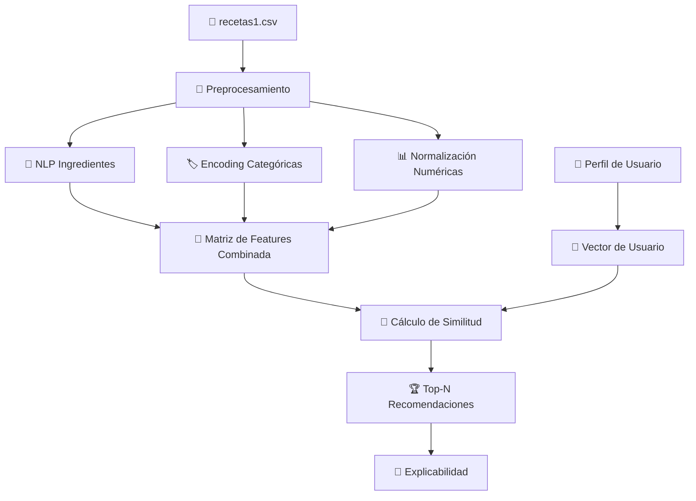
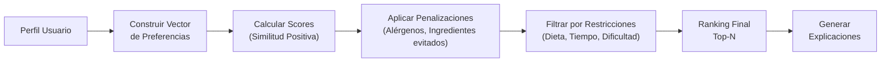

# Sistema de Recomendación de Recetas Basado en Contenido

## Contexto

Se construirá un sistema de recomendación basado en contenido para un dataset de **100 recetas** (archivo `recetas1.csv`, separado por `;`) con las siguientes columnas:

| Columna | Tipo | Ejemplo |
|---------|------|---------|
| `id_receta` | Identificador | `rec_001` |
| `nombre` | Texto | `Arepa con huevo frito` |
| `tipo_cocina` | Categórica | `Colombiana`, `Internacional` |
| `tipo_comida` | Categórica | `Desayuno`, `Almuerzo`, `Merienda` |
| `dieta_compatible` | Multi-etiqueta | `Omnívoro, Vegetariano, Vegano` |
| `alergenos_presentes` | Multi-etiqueta | `Lácteos, Huevo, Gluten`, `Ninguno` |
| `tiempo_total_min` | Numérica | `15`, `90` |
| `nivel_dificultad` | Categórica ordinal | `Principiante`, `Intermedio`, `Avanzado` |
| `ingredientes` | Texto libre | `2 arepas de maíz, 2 huevos, aceite, sal al gusto` |

> [!IMPORTANT]
> **Python no está instalado** en este sistema. Necesitaré instalar Python y las dependencias requeridas antes de ejecutar el código. ¿Tienes Python instalado en otra ubicación, o debo guiarte para instalarlo?

## Propuesta de Arquitectura



## Propuesta de Cambios

### Estructura de Archivos

Se creará la siguiente estructura modular:

```
sistema_recomendacion/
├── recetas1.csv                    # Dataset existente
├── requirements.txt                # [NEW] Dependencias
├── src/
│   ├── __init__.py                 # [NEW]
│   ├── preprocesamiento.py         # [NEW] Pipeline de limpieza y NLP
│   ├── feature_engineering.py      # [NEW] Construcción de features
│   ├── modelo_recomendacion.py     # [NEW] Motor de recomendación
│   ├── perfil_usuario.py           # [NEW] Gestión de perfiles
│   ├── explicabilidad.py           # [NEW] Módulo de explicaciones
│   └── evaluacion.py              # [NEW] Métricas de evaluación
├── main.py                         # [NEW] Ejecución completa con ejemplo
└── README.md                       # [NEW] Documentación
```

---

### Módulo 1: Preprocesamiento (`src/preprocesamiento.py`)

#### Pipeline de limpieza de ingredientes (NLP)

1. **Separación** por comas
2. **Eliminación de cantidades y unidades**: regex para remover números, fracciones (`1/2`, `1/4`), unidades (`taza`, `cucharada`, `g`, `ml`, `lata`, `tajadas`, etc.)
3. **Eliminación de expresiones genéricas**: `al gusto`, `opcional`, `para freír`, `del día anterior`, `cocido/a`
4. **Lowercase y normalización**: tildes preservadas (español)
5. **Stopwords en español**: eliminación de artículos, preposiciones (`de`, `con`, `la`, `el`, `un`, `una`, etc.)
6. **Lematización/Stemming**: Uso de NLTK SnowballStemmer para español o lematización manual con diccionario de ingredientes comunes
7. **Resultado**: lista limpia de ingredientes únicos por receta

**Ejemplo de transformación:**
```
Input:  "2 arepas de maíz, 2 huevos, aceite, sal al gusto"
Step 1: ["2 arepas de maíz", "2 huevos", "aceite", "sal al gusto"]
Step 2: ["arepas de maíz", "huevos", "aceite", "sal"]
Step 3: ["arepas maíz", "huevos", "aceite", "sal"]
Step 4: ["arepa", "maíz", "huevo", "aceite", "sal"]
```

#### Procesamiento de columnas categóricas

| Columna | Tratamiento |
|---------|-------------|
| `tipo_cocina` | Label/One-Hot Encoding (2 valores: Colombiana, Internacional) |
| `tipo_comida` | One-Hot Encoding (3 valores: Desayuno, Almuerzo, Merienda) |
| `dieta_compatible` | MultiLabelBinarizer (valores: Omnívoro, Vegetariano, Vegano) |
| `alergenos_presentes` | MultiLabelBinarizer (valores: Lácteos, Huevo, Gluten, Nueces, Mariscos, Ninguno) |
| `nivel_dificultad` | Ordinal Encoding (Principiante=1, Intermedio=2, Avanzado=3) + normalización |
| `tiempo_total_min` | MinMaxScaler normalización [0,1] |

---

### Módulo 2: Feature Engineering (`src/feature_engineering.py`)

#### Componentes del vector de features por receta:

1. **TF-IDF de ingredientes limpios** (~50-80 dimensiones)
   - Cada ingrediente limpio como token
   - `TfidfVectorizer` sobre el string unido de ingredientes
   
2. **CountVectorizer de tipo_cocina + tipo_comida** (~5 dimensiones)
   - Representación binaria de categorías

3. **MultiLabelBinarizer para dieta_compatible** (~3 dimensiones)
   - Columnas: Omnívoro, Vegetariano, Vegano

4. **MultiLabelBinarizer para alergenos_presentes** (~6 dimensiones)
   - Columnas: Lácteos, Huevo, Gluten, Nueces, Mariscos, Ninguno

5. **Nivel de dificultad normalizado** (1 dimensión)

6. **Tiempo total normalizado** (1 dimensión)

**Concatenación final**: scipy sparse matrix o numpy dense array (~65-95 dimensiones)

#### Pesos por componente:

| Componente | Peso sugerido | Justificación |
|-----------|---------------|---------------|
| Ingredientes (TF-IDF) | 0.40 | Core del sabor y contenido |
| Dieta compatible | 0.20 | Restricción crítica |
| Alérgenos | 0.15 | Restricción de seguridad |
| Tipo de comida | 0.10 | Contexto temporal |
| Tipo de cocina | 0.05 | Preferencia cultural |
| Tiempo | 0.05 | Conveniencia |
| Dificultad | 0.05 | Accesibilidad |

---

### Módulo 3: Modelo de Recomendación (`src/modelo_recomendacion.py`)

#### Estrategias implementadas:

1. **Cosine Similarity** (principal)
   - Calcula similitud entre vector de usuario y cada receta
   - `sklearn.metrics.pairwise.cosine_similarity`

2. **Nearest Neighbors** (alternativa)
   - `sklearn.neighbors.NearestNeighbors` con métrica coseno
   - Permite indexar para búsqueda eficiente

3. **Similitud Híbrida**
   - Combina similitud textual (ingredientes) con similitud estructural (metadata)
   - Ponderación configurable

#### Flujo de recomendación:



---

### Módulo 4: Perfil de Usuario (`src/perfil_usuario.py`)

#### Estructura del perfil:

```python
usuario = {
    "ingredientes_favoritos": ["aguacate", "queso", "pollo"],
    "ingredientes_evitados": ["cebolla"],
    "dieta": ["Vegetariano"],
    "alergenos": ["Lácteos"],
    "tipo_comida_preferida": ["Desayuno"],
    "tipo_cocina_preferida": ["Colombiana"],
    "tiempo_maximo": 30,
    "nivel_dificultad": ["Principiante"]
}
```

#### Construcción del vector de usuario:

1. **Ingredientes favoritos** → vector TF-IDF sintético (afinidad positiva)
2. **Tipo de cocina/comida preferida** → one-hot encoding
3. **Dieta** → binarización para matching
4. **Restricciones negativas** (aplicadas como filtros/penalizaciones):
   - Ingredientes evitados → penalización de score (-0.5 por ingrediente)
   - Alérgenos → **exclusión dura** (receta eliminada si contiene alérgeno)
   - Tiempo máximo → filtro booleano
   - Nivel de dificultad → filtro booleano

---

### Módulo 5: Explicabilidad (`src/explicabilidad.py`)

Genera texto explicativo para cada recomendación indicando:

- Ingredientes en común con los favoritos
- Dieta compatible
- Tiempo de preparación
- Tipo de cocina/comida coincidente
- Porcentaje de match

**Ejemplo de salida:**
```
🍳 Arepa con huevo frito (Score: 0.87)
   ✅ Contiene: maíz, huevo (2 de tus favoritos)
   ✅ Compatible con dieta: Omnívoro
   ✅ Tiempo: 15 min (dentro de tu límite de 30 min)
   ✅ Cocina: Colombiana (tu preferencia)
   ⚠️ Alérgeno: Huevo
```

---

### Módulo 6: Evaluación (`src/evaluacion.py`)

#### Métricas implementadas (sin ratings explícitos):

| Métrica | Método |
|---------|--------|
| **Precision@K** | Proporción de recetas recomendadas que cumplen restricciones del usuario |
| **Recall@K** | Proporción de recetas relevantes cubiertas por las recomendaciones |
| **Diversidad** | Distancia promedio entre las recetas recomendadas (1 - similitud promedio intra-recomendaciones) |
| **Cobertura** | Proporción del catálogo total cubierto por todas las recomendaciones |
| **Relevancia Semántica** | Overlap promedio de ingredientes favoritos en las recetas recomendadas |

#### Evaluación con usuarios sintéticos:

Se crearán perfiles de prueba variados para validar el sistema con distintos escenarios.

---

### Archivo principal (`main.py`)

Ejemplo completo de ejecución:

1. Cargar y preprocesar datos
2. Construir matriz de features
3. Crear perfil de usuario de ejemplo
4. Generar recomendaciones Top-5
5. Mostrar explicaciones
6. Ejecutar métricas de evaluación
7. Comparar estrategias (Cosine vs KNN)

---

### Dependencias (`requirements.txt`)

```
pandas>=1.5.0
numpy>=1.23.0
scikit-learn>=1.2.0
nltk>=3.8.0
scipy>=1.10.0
```

## Open Questions

> [!IMPORTANT]
> **Python no está instalado en tu sistema.** ¿Deseas que incluya instrucciones para instalar Python, o ya lo tienes en otra ubicación?

> [!NOTE]
> El dataset contiene solo **2 tipos de cocina** (Colombiana, Internacional) y **3 tipos de comida** (Desayuno, Almuerzo, Merienda). El sistema se adaptará a esta distribución pero tendrá mayor capacidad de discriminación por **ingredientes** y **dieta/alérgenos**.

## Verificación

### Pruebas automatizadas
- Ejecución del pipeline completo con `python main.py`
- Verificación de que las recomendaciones excluyen alérgenos del usuario
- Verificación de que ingredientes evitados reducen el score
- Verificación de que las recomendaciones respetan filtros de tiempo y dificultad
- Comparación de resultados entre estrategia Cosine y KNN

### Validación manual
- Revisión de las explicaciones generadas para coherencia
- Verificación visual de que los ingredientes se limpian correctamente
- Revisión de los scores y rankings para múltiples perfiles de usuario

## Limitaciones documentadas

| Limitación | Descripción | Mitigación |
|-----------|-------------|------------|
| **Cold Start** | Sin historial de usuario, solo preferencias declaradas | Se usa perfil explícito con preferencias |
| **Sobreespecialización** | Puede recomendar recetas muy similares | Métrica de diversidad + penalización de redundancia |
| **Catálogo pequeño** | 100 recetas limitan la variedad | Diseño escalable para futuro crecimiento |
| **Sin ratings** | No hay retroalimentación explícita | Evaluación basada en reglas y restricciones |

## Extensiones futuras

1. **Sistemas Híbridos**: Combinar Content-Based con Collaborative Filtering cuando existan múltiples usuarios
2. **Deep Learning / Embeddings**: Usar transformers (BERT multilingual) para embeddings semánticos de ingredientes
3. **Recomendación Contextual**: Incorporar hora del día, clima, estación del año
4. **Interfaz Web**: Dashboard interactivo con Flask/Streamlit
5. **Feedback Loop**: Sistema de ratings para retroalimentar el modelo